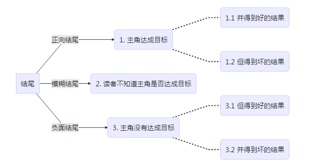
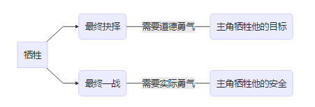
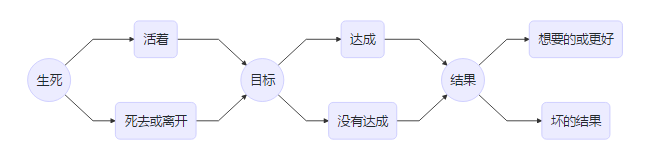

# 小说结尾写法

## 什么是好的结局？
1. 结局要感觉符合这本小说所属的类型。
特定的类型一般会有固定的结尾，偏爱某类型的读者会期盼原以习惯的结尾出现。比如爱情题材通常会让男女主角走到一起。
如果你不想限制结局，可以先处理好结局后，再回头想它类似哪种类型的结局，然后选择该类型发表以获得更多读者。
2. 结局要让读者感到惊讶，并不会熟悉到仿佛以前在哪里看过。
过去颇为新颖的写法，到了现在可能已经变成俗套。

## 冲击结尾
**尽可能将情节的紧绷情绪拖到最后一刻**。

接近结尾时，对手必须感觉要赢了，每件事都对他有利，主角反而身陷危机。只有等到主角挖掘出内心深藏的力量，有所行动时，你才做出最后一击。

引出冲击结局后，你必须写出最后一场戏，了结主角个人生活中的某些事。最后带出“真好”与“糟了”的感受。无论好还是糟，这个故事都已经结束了。

真好： 一些事情得到解决或正开始解决。

糟了： 还有其他危险在继续。

也就是现代故事常使用的反转，好与坏不停的转变。反转可以一直继续，但要让读者越来越不容易想到，以及所有反转都必须有铺垫。
结尾的类型

好的模糊结尾，也就是常说的开放式结局必须带给读者强烈的感受，而且感觉合理，还能激起讨论。

## 结尾的类型

好的模糊结尾，也就是常说的开放式结局必须带给读者强烈的感受，而且感觉合理，还能激起讨论。

##  牺牲的类型
当有人为了大众利益放弃自我命运，便会触及人们心中最深的向往。

目标与安全统一：实现一个就必须实现另一个。如：他只有活下去才能救她。

目标与安全冲突：必须放弃一个才能实现另一个。如：想救她，他必须去死。

统一型故事易表现角色才智，冲突型故事易表现角色人格。
## 其他角色
不仅是主角，其他次要角色也应该有自己的结局。可以从三个维度来安排结局，以给不同角色以不同结局。

如下面这张表，如果有着完全相同的构成，可以考虑将角色合并。

## 意外结局
### 写出意外的结局

- 三十分钟内想出十个不同的结局，越快越好，不要求每个结局都有道理
- 之后花一两天思考这些结局
- 列出前四名，稍微加深每段情节，再酝酿一下
- 最后选出最适合当转折的结局，不一定替代原先结局，而是添加一点意外元素
- 在情节中四处埋些小线索，让这个转折变得合理
### 收掉四散的伏笔
- 先判断这些四散的伏笔是否重要，还是只是陪衬（凭感觉判断）
- 如果很重要，必须加入场景来处理
- 较小的伏笔，可以让角色解释就够了（角色说句话带过即可）
- 要找出没收好的伏笔最好办法，是找几个人来读你的初稿。读完后还遗留的问题就是没收的伏笔。如果是连载类作品，就是看评论，读者还在讨论的问题就是你没处理完的。

## 最后一页的回响
新近效应： 读者评断你的作品时，会依赖他们最新的感受，也就是对结尾的看法。如果是连载类，就是上一章或上一个情节线的结尾。

只要结尾让他们留下深刻印象，你就能累积起读者群。
## 语言结尾
结尾每个字都必须字斟句酌。读者读完结尾后会很长时间没机会看你写的东西，这意味着结尾是停留在读者脑海里最长时间的，读者很可能反复思考结局直到有了新的故事。

i) 用对话结尾
别显得太刻意。
可以在小说稍早的段落中，安插与结尾类似的对话。
这样会显得前后呼应，使对话具有深意。如，在电影《楚门的世界》中，主角有一句给人打招呼的语句，最后用此句来做结尾。
并不是去想用主角的那句话来结尾，而是想好要用那句话结尾后安排主角在中段说一次这句话。
ii) 用叙述结尾
如果一段场景或角色的描写感觉对了，也可以成为完美的结局。
所描写的场景或事物要能给故事中人物带来独特的感受。
情感类题材经常使用。被带来感受的不一定是主角，可以是任何故事中的角色。如，爱情故事男女主角走到一起，路过一个小哥看见后，感受到爱情的力量当即决定向女朋友求婚。收笔，故事完。当然感觉不能这么简单，只要将感觉释放出来了，就收。
iii) 用总结结尾
替角色的感受圆满作结，别让读者觉得作者过渡干预。
实在没有什么特别的感受，或者主角的感受都包含在了故事中，再讲就啰嗦了。那最后给做个总结，然后收笔。
## 不要急着结束
### 如何避免因疲惫而匆匆结局？

1.  运用梦境
每次做梦后把梦境记下来，集结成一本梦境合集。想想这些梦跟你的小说结局能如何联结。
或许并非直接有关，但至少可以去刺激你更深入思考结局。
作家最原创的灵感都储存在梦乡里。
2. 突变规模
写到结尾时千万不要退缩，反而要投注全心全力，带着热情，发挥极致的创意来写结局。
如果是开头人与人之间的故事，结局可以上升到社会层面。
如果是开头社会对抗型故事，结局可以下沉到人与人或个人内心。
从小规模变到大规模，或大规模缩到小规模，对比之下能极大吸引读者，留下深刻印象。
3. 规律写作
纪律很重要，别把自己逼到截稿期限的极限。尽可能的养成规律写作，每日固定一段时间输出文字。不必是小说内容，任何类型都可以，甚至可以整理资料。总之就是每日训练将大脑意识转化为文字。
持续锻炼输出能力，避免陷入“不知道写什么”而草草结尾。

小说章节结尾的核心在于制造悬念（Hook）、推动情节或升华情感，让读者产生“必须看下一章”的冲动。常用技巧包括：在危机最高点戛然而止、抛出意外的转折、揭露部分真相但引出更大谜团，或用富有感染力的环境描写/心理活动收尾。
小说章节结尾的五大有效策略：
悬念/危机结尾（Cliffhanger）： 在主角身陷绝境、面临重大威胁或紧急抉择时立刻切断，例如“枪声响了，他感觉胸口一凉...”，促使读者翻页。
出人意料的转折（Twist）： 结尾揭露一个打破之前所有逻辑的真相，或引入一个突发事件，让剧情“峰回路转”。
“真好/糟了”法（Good/Bad End）： 章节结尾包含“好的解决”（角色暂时脱险）与“糟的隐患”（发现了更深层危险）的结合，带来一种好坏交替的节奏感。
情感渲染与沉淀： 在激烈冲突后，用细腻的环境描写（如夜幕、雨声）或角色深刻的心理独白来收尾，营造余音绕梁的感觉，暗示角色命运的复杂性。
交代伏笔/新线索： 交代清楚本章悬念的同时，引出一个全新的、更高级的伏笔，保持情节的连续性。 
教育百科| 教育雲線上字典
教育百科| 教育雲線上字典
 +3
结尾检查点：
是否矛盾？ 检查结尾是否符合人物设定和之前的逻辑。
是否多余？ 避免过多的总结性废话，简洁有力地收尾。
情绪点： 结尾的情绪是否是本章的最高点或转折点。

小说章节的钩子（Hook）是抓住读者注意力的关键情节或悬念，目的是促使他们继续阅读。有效挂钩子需要在章节末尾制造未解决的冲突、抛出核心问题、揭露震惊事实、或者处于危险边缘，让读者不看到下一章不罢休。
以下是具体的挂钩子技巧：
1. 悬念式结尾（Cliffhanger）
在动作、对话或高潮事件进行到一半时切断章节。
例子：“枪声响了，我感到胸口一阵剧痛。”（下一章揭晓是否中枪、是谁开枪）
要点：中断动作序列，不要给明确结局。
2. 揭露致命情报
在章节结束前，主角发现了一个颠覆认知的秘密。
例子：“我终于打开了信封，信里的名字，竟然是我的亲生父亲。”
要点：信息要足够震撼，足以推翻之前的铺垫。
3. 制造两难困境（Dilemma）
让主角陷入无论怎么选都会失去重要东西的境地。
例子：“想要救妹妹，就必须杀了眼前的盟友。”
要点：强调主角的内心挣扎和时间紧迫感。
4. 抛出不可解答的疑问
让主角（和读者）对当前发生的事感到疑惑。
例子：“他明明已经死了，为什么现在站在我的床边？”
要点：打破常规逻辑，产生“为什么”的强烈好奇心。
5. 情感错位/反差
利用意料之外的情感反应来挂钩子。
例子：在一场谋杀案后，嫌疑人却在温柔地抚摸猫咪。
要点：展现角色的矛盾面，引导读者探究其内心。
6. 使用“承诺”挂钩
承诺下一章将会有更精彩的剧情或重要转折。
方法：章节末尾提到一个马上要进行的重要仪式、决斗或揭秘会议。
挂钩子时的注意事项：
真诚悬念：不要使用假挂钩（例如：下一章告诉其实是主角做梦），否则会引发读者反感。
自然流畅：钩子要融入剧情，不要生硬塞入。
回应上一个钩子：新的一章开始时，要对上一章的钩子进行部分回应或升级，而不是直接跳过。

先说几个埋钩的注意事项： 
1. 除前几章要注意埋钩， 后面的其实不需要每章都埋。  
2. 如果你的章节全是把话说完、把动作做完、把情绪都交代干净了，等于是”自掘坟墓“，钩子会无处可埋…… 如果要埋，得提前留转折点，让章末有新“台阶”。 
3. 钩子是要和下一章强绑定的，不要只是个烟雾弹， 否则是要掉粉的。  
4. 钩子不要太抽象，比如“危险正在逼近“、”他感到不安“…… 之类的， 这是废话！
再说如何钓鱼：
网文中，章末钩子，永远来自五个字：信息不闭合。
它的原则：让事情变糟，别让事情结束。
读者就会有不适感，会觉得“等下，这事没完……”，而疯狂期待下一章。
先看看大佬们是如何钓鱼的， 最常见的就是说一半“关键事实“。
比如《鬼吹灯》常用的章末结构：
> 老胡低声说了一句话，我手里的手电，瞬间灭了。

《凡人修仙传》中很多章末不是“他决定冒险”，而是：

> 他已经踏进去，而阵法开始启动。
阵法启动了……
丹药吞下去了……
身份暴露了……

另外，比如《诡秘之主》常用的”决策型钩子“：角色必须选一条烂路……两个选择，都是代价。
……本章解决一个问题，章末抛一个更结构性的问题…………

总结了一下四种留钩模型（不一定对）:

模型一：认知反转型(人类对被骗的敏感度极高，这会强迫大脑继续追索真相)
适合：悬疑、现实、都市、科幻。
公式：
> 已确认的信息 × 被否定

例子：

> 原以为那封信是假的，可现在，他在警局看到了原件。

模型二：利益临界点
适合：爽文、升级流、职场、商战
公式：

> 目标即将到手 × 更大的代价出现

《大王饶命》经常这么干：

> 积分刚到账，系统却弹出了新的任务提示。

爽点不结束，而是被条件化。这是最符合商业连载的写法。

模型三：角色选择型
适合：现实主义、人物向小说。

公式：

>A和 B都不完美，必须现在选

比如：

>电话那头，一个是母亲，一个是警察。

模型四：不可逆状态型
适合：修仙、悬疑、冒险、生存流、理性主角向连载小说。

公式：
> 行为已执行 × 状态已锁死（不可回滚）

《凡人修仙传》大量使用：

> 他已经踏进阵法，而阵法开始启动。
丹药吞下去了。。。
禁制触发了。。。
身份暴露了。。。。

埋钩通常是这么一个流程：
写每一章时，问自己几个问题并记录下来

1. 本章主题是什么？（解决什么问题） 
2. 解决后自然暴露什么新问题？ 
3. 这个新问题能不能在章末以一句话、一行为外壳呈现？ 
4. 下一章是否立刻对这个问题展开？

这样写几次之后，你的钩子会自然发育，不用刻意制造噱头。

它的结构如下：
> 本章解决一个表面问题 →
让读者以为阶段性安全 →
章末只给一个新变量，不解释
要注意：
只给一个、
不要任何解释、
这个变量必须影响“下一章的核心矛盾”，它不是彩蛋又似彩蛋

切记别一上来就模仿大神的“高级留白”。那是建立在读者已经信任你的前提上。其实章末钩子就这一个原则：让事情变糟，别让事情结束。如果你在用一些 AI 工具辅助写作。 比如 http://ai-xz.com 这类小说创作工具。 一个正确用法是：让 AI 帮你枚举三种章末走向， 但选哪个，一定要你自己判断读者爽点。

